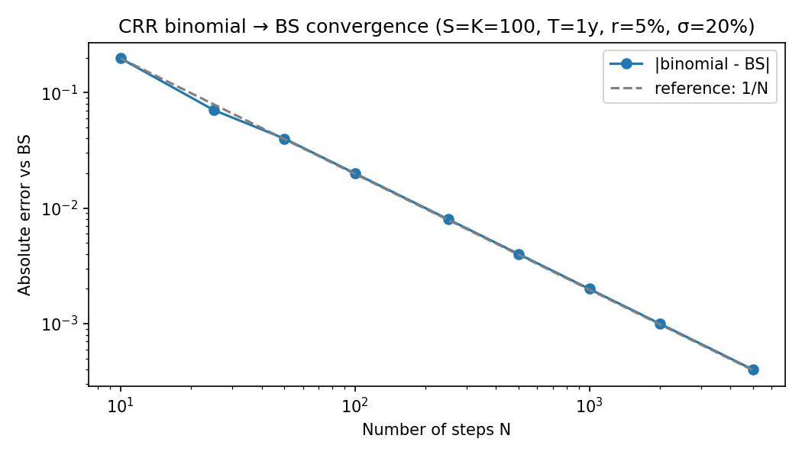
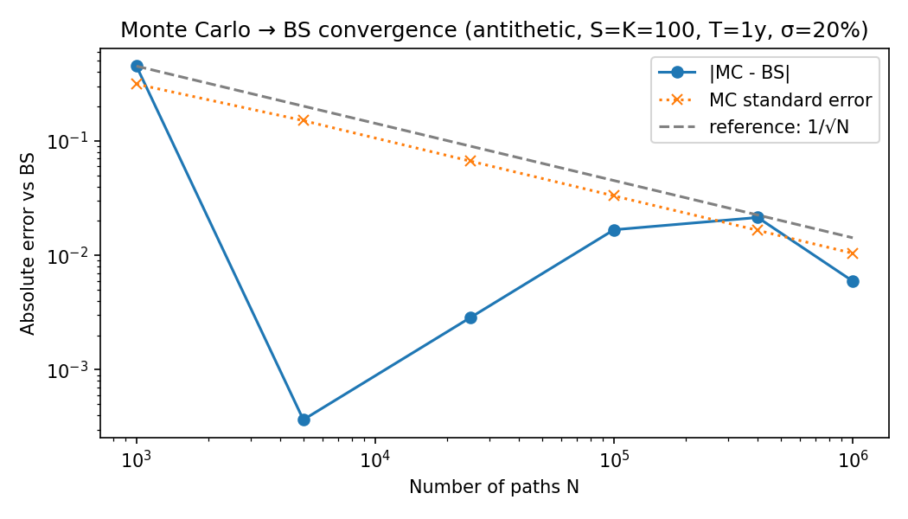
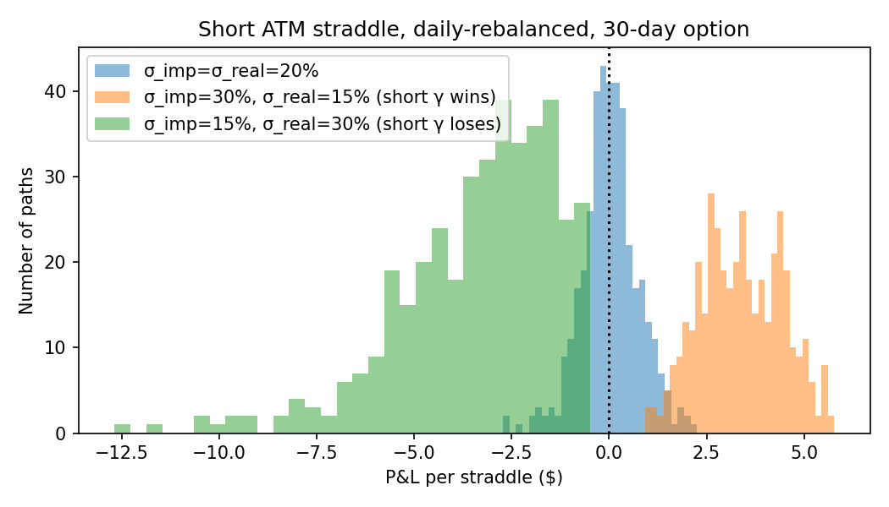

# Options Pricing & Delta-Hedging Research

A self-contained research framework for pricing equity index options three ways
(Black-Scholes analytical, Cox-Ross-Rubinstein binomial tree, Monte Carlo with
variance reduction) and stress-testing the pricing engine against real SPY
market quotes. Includes an implied-volatility surface fitter and a discrete
delta-hedging simulator that decomposes short-straddle P&L into theta, gamma
and residual hedging error.

---

## Design principles

1. **Right tool for the right job.** Each pricing method is applied to the
   option type where it earns its place — Black-Scholes for European vanillas
   (closed form), binomial tree for American options (early-exercise handled
   via backward induction), Monte Carlo for an Asian (path-dependent payoff
   where trees do not recombine).
2. **Honest validation.** Convergence rates (binomial steps, MC paths) are
   measured and plotted. Greeks are computed three ways (analytical,
   tree-based, MC pathwise / common-random-number bump) and cross-checked
   against each other within statistical tolerance.
3. **From price to P&L.** A delta-hedging simulator runs a short ATM straddle
   with daily rebalancing across many trade dates, decomposing realised P&L
   into theta collected, gamma paid, and residual hedging error. The
   realised-vs-implied volatility axis is the dominant driver, by design.

---

## Quickstart

```bash
git clone https://github.com/Chaitanya2540/options-pricing-research.git
cd options-pricing-research

python -m venv .venv && source .venv/bin/activate
pip install -r requirements.txt
pip install -e .

pytest
streamlit run app/streamlit_app.py
```

---

## Repository structure

```
options-pricing-research/
├── src/options/
│   ├── pricing/
│   │   ├── black_scholes.py    # closed-form European pricing + Greeks
│   │   ├── binomial.py         # CRR tree, European + American
│   │   └── monte_carlo.py      # GBM paths, antithetic + control variates
│   ├── greeks.py               # cross-validation across pricing methods
│   ├── iv.py                   # Brent solver, IV surface fitting
│   ├── hedging.py              # short-straddle gamma-scalp simulator
│   ├── data.py                 # SPY chain + spot ingestion (yfinance)
│   └── utils.py                # year-fractions, CDF/PDF wrappers
├── tests/                      # pytest regression suite
├── app/streamlit_app.py        # interactive dashboard
├── notebooks/                  # exploratory analysis
├── docs/                       # convergence study, hedging attribution, concepts reference
├── results/                    # checked-in figures and JSON for the README
├── data/raw/                   # cached chain snapshots (gitignored)
├── scripts/                    # one-shot data fetches and analyses
├── requirements.txt
├── pyproject.toml
└── LICENSE
```

---

## Methodology

| Module | Method | Best applied to | Why |
|---|---|---|---|
| `pricing.black_scholes` | Closed-form analytical | European calls / puts | Truth source, vectorisable, instant. |
| `pricing.binomial` | CRR backward induction | American puts | Handles early-exercise via `max(continuation, exercise)`. |
| `pricing.monte_carlo` | GBM + antithetic + control variates | Asian (arithmetic average) | Path-dependent payoffs; control-variates with closed-form geometric Asian. |
| `greeks` | Analytical + FD + pathwise | Cross-validation | Agreement between methods is evidence of correctness. |
| `iv` | Brent's method | Inverting BS for implied vol | Robust on bracketed monotonic root. |
| `hedging` | Daily-rebalanced delta hedge | Short ATM straddle | Classic gamma-scalp; P&L decomposes cleanly. |

---

## Headline results

Reference setup: European call, S=K=100, T=1y, r=5%, σ=20%. BS truth = **$10.4506**.

**Convergence (matches theoretical rates):**

| Method | At N=100 | At N=1000 | At N=5000 |
|---|--:|--:|--:|
| Binomial vs BS, abs error | 0.0200 | 0.0020 | 0.00040 |
| MC standard error (antithetic, no CV) | 0.033 (100k paths) | 0.010 (1M paths) | — |

Binomial error halves as N doubles (O(1/N), confirmed). MC standard error
quarters as paths quadruple (O(1/√N), confirmed).





**Greeks cross-validation (European call, ATM, T=1y, σ=20%):**

| Greek | Black-Scholes | Binomial | Monte Carlo (pathwise) |
|---|--:|--:|--:|
| Delta | 0.6368 | 0.6367 (1000 steps) | 0.6364 ± 0.0005 |
| Gamma | 0.0188 | 0.0188 (1000 steps) | 0.0187 ± 0.0008 (CRN bump) |
| Vega | 37.52 | — | 37.50 ± 0.07 |

All three methods agree on price, delta, gamma, and vega within statistical
tolerance — independent confirmation that no method has a sign-flip or
scaling bug.

**Short ATM straddle, gamma-scalp (30-day, daily rebalance, 400 paths/regime):**

| Regime | σ_imp | σ_real | Mean P&L | Win rate |
|---|--:|--:|--:|--:|
| Neutral | 20% | 20% | $0.02 | 51% |
| Sold rich vol | 30% | 15% | **+$3.39** | **100%** |
| Sold cheap vol | 15% | 30% | **−$3.34** | **0%** |

Selling rich vol that comes in low → 100% of paths profitable. Selling cheap
vol that comes in high → 0% of paths profitable. The textbook short-gamma
result, confirmed end-to-end. Full discussion in
[docs/hedging_attribution.md](docs/hedging_attribution.md).



---

## License

MIT — see [LICENSE](LICENSE).
